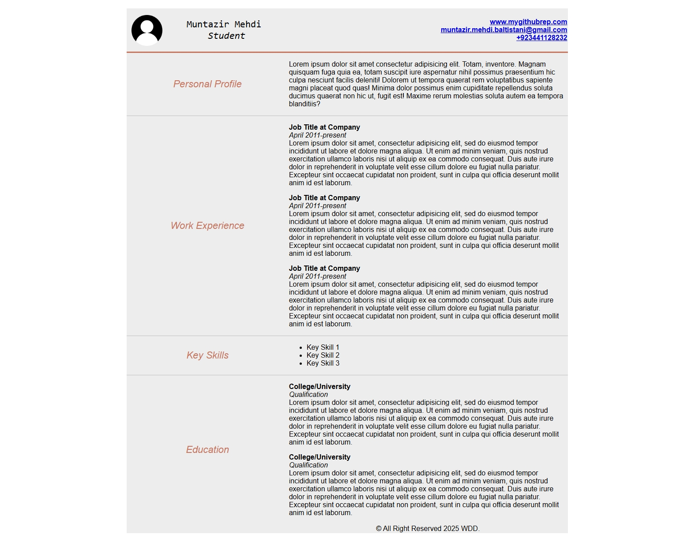

# 💻 Web Development Lab Task 01

This repository contains the solution to **Lab Task 1** of the Web Development course. The task demonstrates the use of HTML tables to create a structured layout for a CV (Curriculum Vitae) page.

## 📌 Task Description

Use your HTML knowledge to develop a CV layout using only **a single `<table>` element** to structure the entire page. The use of external CSS is allowed, but the layout itself must be constructed using **only one table**.

---

## 🌐 Live Preview

👉 [Click here to view the live page](https://muntazir-43.github.io/Web-Development-Lab-Tasks/Lab%20Task%201/Lab_Task_1.html)

---

## 🧠 Features

- Single table-based layout
- Responsive and centered design
- Includes:
  - Profile picture
  - Contact info (email, phone, GitHub)
  - Personal Profile section
  - Work Experience
  - Key Skills
  - Education

---

## 📸 Screenshot

---

## ✅ How to Run

1. Clone or download the repository.
2. Open `Lab_Task_1.html` in any modern browser.
3. Ensure the image path remains correct: `Assets/account-icon.png`.

---

## 🛠️ Tools Used

- HTML5
- CSS3 (Internal style block)
- No external frameworks or JavaScript

---

## ©️ License

This project is submitted as part of a lab assignment and is for educational purposes only.
