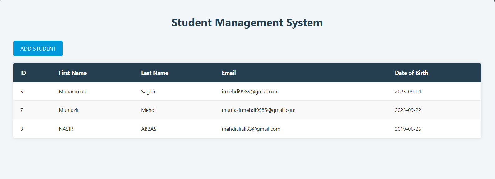
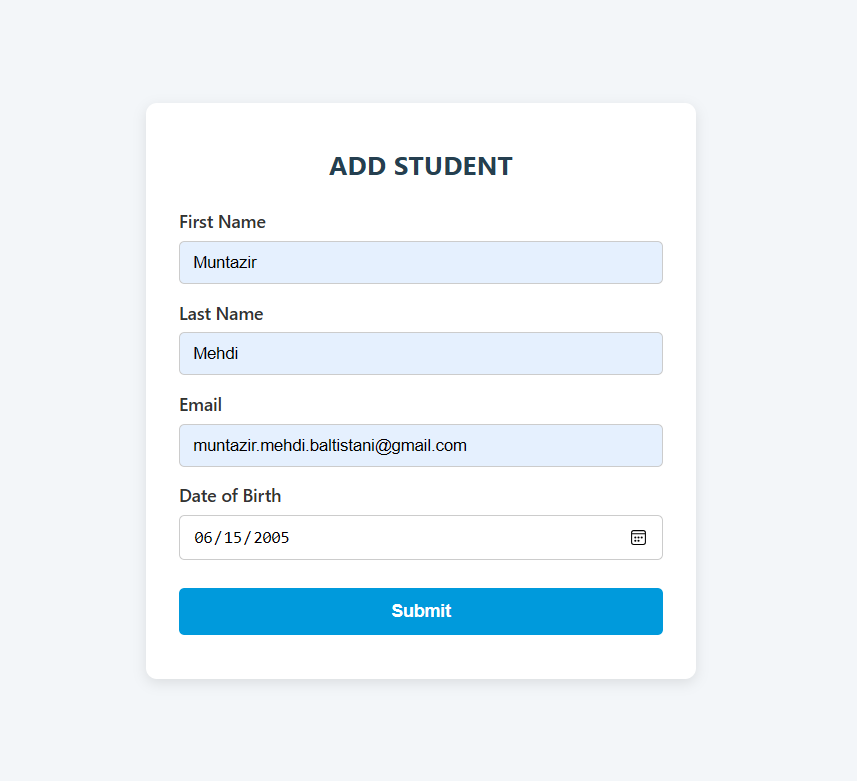

# 💻 Web Development Lab Task 11 — Student Management System (CRUD)

This directory contains **Lab Task 11** for the Web Development course. The project implements **CRUD operations (Create & Read)** for a simple **Student Management System**, including a **dashboard, add student form, and student list view**.

---

## 🖼️ Preview

- **Student Table / Dashboard**  
  

- **Add Student Form**  
  <p align="center">
    
  </p>

---

## 🎯 Key Features
- Student Dashboard with record listing  
- Add Student form with validation  
- Database connectivity for Create & Read operations  
- Clean and responsive UI  

---

## 🛠 Technologies
- HTML5, CSS3, JavaScript  
- Backend: PHP (or similar)  
- Database: MySQL  

---

## 📦 Setup
1. Clone the repository:
   ```bash
   git clone https://github.com/Muntazir-43/Web-Development-Lab-Tasks.git
   ```
2. Navigate to this task:
   ```bash
   cd "Web-Development-Lab-Tasks/Lab Task 11"
   ```
3. Import database and update credentials in backend config.
4. Run server and open index.html in browser.

---
   
🧑‍💻 **Developed by:** Muntazir Mehdi  
🎓 **Department:** Software Engineering  
🏛️ **University:** University of Azad Jammu & Kashmir

---

## 📃 License

This code is part of an academic lab submission and is intended for educational use only.

---
