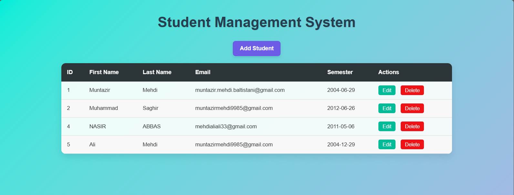
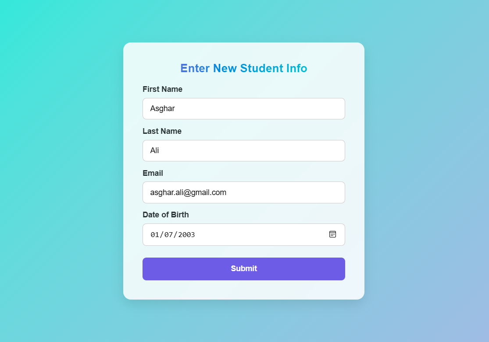
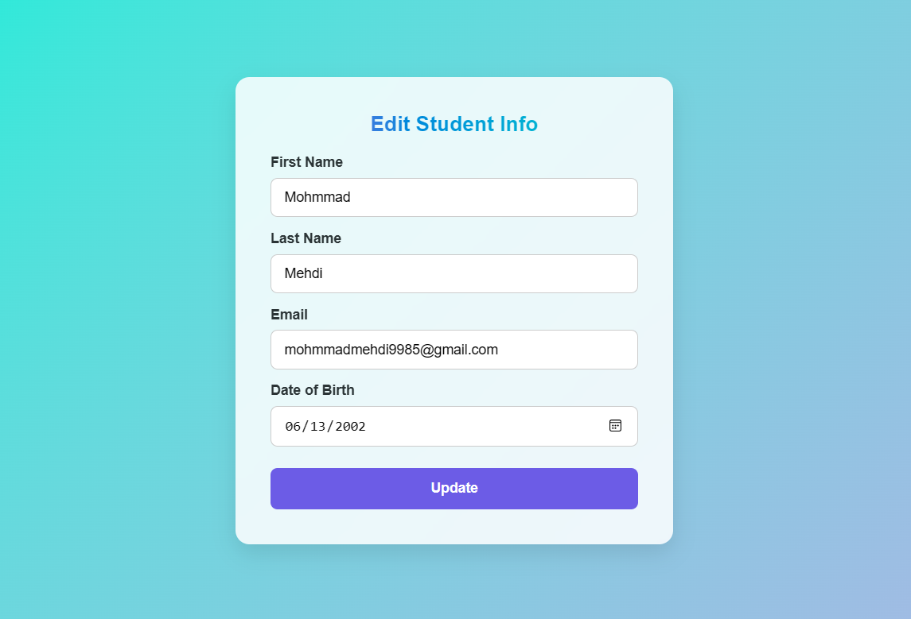
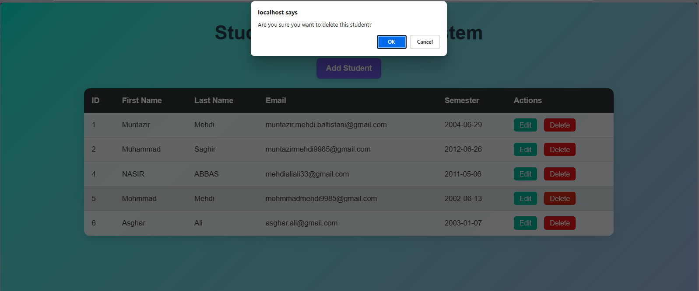

# 💻 Web Development Lab Task 12 — Student Management System (Full CRUD)

This directory contains **Lab Task 12** for the Web Development course. This project extends the previous version to support full **CRUD operations** (Create, Read, Update, Delete) in a **Student Management System**, with a management dashboard, add/edit/delete forms, and student list view.

---

## 🖼️ Preview

- **Dashboard / Table View**  
  

- **Add Student Form**  
  <p align="center">  
      
  </p>

- **Edit Student Form**  
  <p align="center">  
      
  </p>

- **Delete Confirmation / Action**  
  

---

## 🎯 Key Features

- Management dashboard listing all student records  
- Add Student form with validation  
- Edit and update existing student records  
- Delete student records  
- Clean, responsive user interface  

---

## 🛠 Technologies

- Frontend: HTML5, CSS3, JavaScript  
- Backend: PHP
- Database: MySQL  

---

## 📦 Setup & Run

1. Clone the repository:  
   ```bash
   git clone https://github.com/Muntazir-43/Web-Development-Lab-Tasks.git
   ```
2. Navigate to this task:
   ```bash
   cd "Web-Development-Lab-Tasks/Lab Task 12"
   ```
3. Import database and update credentials in backend config.
4. Run server and open index.html in browser.

---
   
🧑‍💻 **Developed by:** Muntazir Mehdi  
🎓 **Department:** Software Engineering  
🏛️ **University:** University of Azad Jammu & Kashmir

---

## 📃 License

This code is part of an academic lab submission and is intended for educational use only.

---
